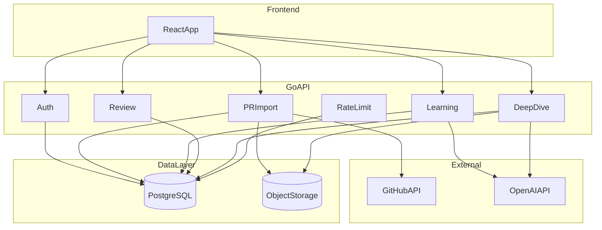
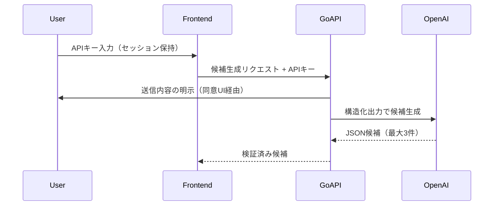

# Code Learning Companion MVP 実装計画

MVP を仕様書順（01→06）かつ Docker Compose 開発環境で段階的に実装する計画。公開ベータ完成条件10項目をリリース基準とする。

## 進捗チェックリスト

- [ ] フェーズ0: Docker Compose + Go/React 骨格 + DB マイグレーション基盤
- [ ] フェーズ1 (spec 01): GitHub OAuth、users テーブル、セッション、認可ミドルウェア
- [ ] フェーズ2 (spec 02): 公開 PR 取り込み、スナップショット保存、周辺コード取得
- [ ] フェーズ3 (spec 03): OpenAI BYOK、候補・問題・回答・フィードバック、根拠検証
- [ ] フェーズ4 (spec 04): 復習スケジュール、別角度再出題、日時進めテスト支援
- [ ] フェーズ5 (spec 05): 深掘り対話、会話ログ、LearningNote 保存
- [ ] フェーズ6 (spec 06): PR/アカウント削除、利用上限、公開ベータ情報明示
- [ ] 公開ベータ完成条件10項目の E2E テスト + README 整備

## 現状

- リポジトリは**ドキュメントのみ**（[requirements.md](../requirements.md)、[detailed-design.md](detailed-design.md)、[specs/](specs/)）
- 実装コード・インフラ設定は未着手
- 技術スタックは要件定義で確定: **React + TypeScript / Go / PostgreSQL / Object Storage / GitHub OAuth / OpenAI BYOK**

## 方針

| 項目 | 決定 |
|---|---|
| 着手順 | 仕様書順（01 → 06）で基盤から積み上げ |
| 開発環境 | Docker Compose（PostgreSQL + MinIO + API + Frontend） |
| PR 単位 | [detailed-design.md](detailed-design.md) のルール通り、**仕様書1つ = 実装PR1つ** |
| スコープ | [future-ideas.md](../future-ideas.md) は MVP 完了まで触らない |

## リポジトリ構成（提案）

```text
/
├── docker-compose.yml
├── .env.example
├── backend/          # Go API
│   ├── cmd/server/
│   ├── internal/
│   │   ├── auth/
│   │   ├── github/
│   │   ├── openai/
│   │   ├── primport/
│   │   ├── learning/
│   │   ├── review/
│   │   ├── deepdive/
│   │   ├── storage/   # S3互換（MinIO）
│   │   └── db/
│   └── migrations/
├── frontend/         # React + TypeScript (Vite)
│   └── src/
│       ├── pages/
│       ├── components/
│       └── api/
└── docs/             # 既存
```

## アーキテクチャ概要



## フェーズ 0: 開発基盤（実装 PR 前の土台）

**目的:** `docker compose up` で全サービスが起動し、以降の仕様 PR を載せられる状態にする。

**作業内容:**

- `docker-compose.yml`: PostgreSQL、MinIO（S3互換）、Go API、Frontend（Vite dev server）
- `.env.example`: `GITHUB_CLIENT_ID/SECRET`、`DATABASE_URL`、`S3_ENDPOINT`、`OPENAI_MODEL` など
- Go: ルーティング骨格、設定読み込み、DB接続、マイグレーション基盤（[golang-migrate](https://github.com/golang-migrate/migrate) 等）
- Frontend: Vite + React + TypeScript、API クライアント骨格、基本レイアウト
- ヘルスチェック API（`/health`）と DB 接続確認

**完了条件:** Compose 起動 → フロント表示 → API ヘルス OK

---

## フェーズ 1: [01-authentication.md](specs/01-authentication.md)

**目的:** GitHub OAuth でユーザー識別、データの `user_id` 分離。

**バックエンド:**

- `users` テーブル（`github_user_id`, `github_login`, `display_name`, `avatar_url`）
- OAuth フロー: `/auth/github/login` → callback → セッション Cookie 発行
- 認証ミドルウェア: 未ログインは学習 API を 401
- ログアウト: セッション無効化

**フロントエンド:**

- ログイン / ログアウト UI
- 認証状態に応じたルートガード

**受け入れ条件（仕様書より）:**

- 同一 GitHub ID → 同一アプリユーザー
- ユーザー A はユーザー B のデータにアクセス不可
- 非公開リポジトリ権限を要求しない

---

## フェーズ 2: [02-public-pr-import.md](specs/02-public-pr-import.md)

**目的:** 公開 PR URL からスナップショットを取得・保存。

**データモデル（PostgreSQL + Object Storage）:**

| エンティティ | PostgreSQL | Object Storage |
|---|---|---|
| PRSnapshot | メタデータ、head SHA、状態 | 本文、差分、レビューコメント |
| CursorUpload | ファイル名、関連 PR | Markdown 本文 |

**バックエンド:**

- PR URL 検証（公開のみ、形式チェック）
- GitHub REST API: PR 詳細、diff、files、commits、review comments
- 周辺コード取得（差分不足時のみ、仕様の3段階）
- エラー種別: 形式不正 / 非公開・不存在 / API 一時エラー
- 任意: Cursor Markdown アップロード（multipart）

**フロントエンド:**

- PR URL 入力フォーム
- Cursor ファイル任意アップロード
- 取り込み進捗・エラー表示

**受け入れ条件:**

- 公開 PR を URL で取り込める
- 取り込み後 GitHub 上の PR が変わってもスナップショットは不変
- Cursor なしでも取り込める

---

## フェーズ 3: [03-learning-questions.md](specs/03-learning-questions.md)

**目的:** プロダクトの核心 — 学習候補・問題・回答・フィードバック。

**データモデル:**

```text
LearningCandidate → LearningSet → Question → AnswerAttempt
```

各エンティティに **根拠参照**（PR番号、commit SHA、ファイルパス、行範囲）を必須化。

**OpenAI BYOK フロー:**



**重要実装ポイント:**

- API キーは **リクエストヘッダーで受け取り、保存・ログ出力しない**（[requirements.md](../requirements.md) §10）
- OpenAI Structured Outputs で候補・問題・フィードバック JSON を生成し、**根拠参照なしは保存拒否**
- 設計意図問題は根拠（PR本文、レビュー、Cursor会話）がある場合のみ
- 問題セット: 選択肢 → 自由記述 → コード記述（2〜3問）
- 理解度: `できた` / `一部できた` / `もう一度` / `判定保留`
- エラー区別: キー無効 / 上限・残高 / 通信 / 出力形式不正

**フロントエンド:**

- API キー入力モーダル（初回 LLM 利用時）
- 送信同意ダイアログ（PR + Cursor 内容の明示）
- 候補一覧（最大3件）→ 1件選択
- 問題解答 UI、根拠表示（`この問題の根拠を見る`）、フィードバック

**受け入れ条件:** 公開ベータ条件 4〜6 に相当

---

## フェーズ 4: [04-review.md](specs/04-review.md)

**目的:** 間隔反復復習（3日 → 14日 → 30日 → 定着済み）。

**データモデル:**

- `ReviewSchedule`: LearningSet、段階、次回日時、状態、最終理解度

**ロジック:**

- 初回学習完了 → 3日後の ReviewSchedule 作成
- 理解度に応じた遷移（`一部できた` は短間隔、`もう一度` は翌日）
- 復習問題は同一 PR スナップショット、**別問い方**で OpenAI 生成
- `復習を終了` / `復習を再開` / `元に戻す`

**テスト支援:**

- 開発・テスト用に **日時を進める API または環境変数**（仕様: 実時間待ちは公開条件にしない）

**フロントエンド:**

- ホーム: 今日の復習予定（最大3件）
- 復習フロー UI

**受け入れ条件:** 公開ベータ条件 7 に相当

---

## フェーズ 5: [05-deep-dive.md](specs/05-deep-dive.md)

**目的:** 問題文脈を保った LLM 自由対話。

**データモデル:**

- `DeepDiveSession`, `DeepDiveMessage`（本文は Object Storage 可）
- `LearningNote`: ユーザー保存の要点・未解決点

**制約（仕様厳守）:**

- 深掘りは **問題・理解度・復習予定を変更しない**
- 問題再生成はしない
- 通常の問題生成コンテキストには **保存した要点のみ** 使用

**フロントエンド:**

- 問題画面からいつでも「深掘りする」
- チャット UI + 要点保存

**受け入れ条件:** 公開ベータ条件 8 に相当

---

## フェーズ 6: [06-data-lifecycle.md](specs/06-data-lifecycle.md)

**目的:** 削除・利用上限・公開ベータ要件の完成。

**PR 単位削除:**

- カスケード削除: スナップショット、候補、問題、回答、復習、深掘り、Cursor ファイル
- Object Storage 上の本文も削除
- 最終確認ダイアログ（復元不可）

**アカウント削除:**

- ユーザー全データ + Object Storage + セッション完全削除

**利用上限（設定値化）:**

- PR 解析: 1ユーザー / 日 5件
- LLM 呼び出し: 1ユーザー / 分 10回
- 超過時は実行せず理由表示

**公開情報:**

- README / アプリ内に: 公開 PR のみ、OpenAI 送信範囲、API キー非保存、削除方法を明示

**受け入れ条件:** 公開ベータ条件 9〜10 に相当

---

## データベース初期スキーマ（フェーズ横断で設計、段階的マイグレーション）

フェーズ 1 から順にマイグレーションを追加。全体像:

```text
users
sessions
pr_snapshots
cursor_uploads
learning_candidates
learning_sets
questions
answer_attempts
review_schedules
deep_dive_sessions
deep_dive_messages
learning_notes
usage_limits / rate_limit_counters（または Redis 相当の PG テーブル）
```

すべての学習データに `user_id` FK。Object Storage キーは `{user_id}/{resource_type}/{id}` 形式。

---

## テスト戦略

| 層 | 方針 |
|---|---|
| Go 単体 | GitHub URL パース、根拠参照検証、復習スケジュール遷移、レート制限 |
| Go 統合 | OAuth モック、GitHub API モック、OpenAI モック（構造化出力 fixture） |
| Frontend | 主要フローのコンポーネントテスト（候補選択、問題回答、削除確認） |
| E2E | 公開ベータ完成条件 10 項目を Playwright 等でシナリオ化（日時進め API 利用） |

OpenAI 実 API は CI では使わず、**fixture JSON** で構造化出力を検証する。

---

## 公開ベータ完成チェックリスト

[requirements.md](../requirements.md) §12 の 10 項目を最終ゲートとする:

1. GitHub OAuth ログイン
2. 公開 PR URL 入力
3. OpenAI API キー（セッション）入力
4. PR 解析 → 最大3候補表示
5. 1候補の問題セット回答
6. 回答・苦手理由・フィードバック保存
7. 復習予定 + 別角度の再出題
8. 深掘り対話
9. PR 単位 / アカウント削除
10. 利用上限・エラー表示

---

## リスクと対策

| リスク | 対策 |
|---|---|
| LLM 問題品質・判定のばらつき | 構造化出力スキーマ + 根拠必須バリデーション；プロンプトを backend に集約し fixture テスト |
| GitHub API レート制限 | 未認証 or PAT 利用方針を早期決定；解析上限（5件/日）と整合 |
| BYOK の利用ハードル | MVP では許容；README にキー取得手順を記載 |
| 周辺コード取得の複雑さ | フェーズ2では最小実装（前後行 + 同一ファイル定義）から開始 |
| 復習日時の E2E | テスト用日時オフセット API をフェーズ4で必須実装 |

---

## 実装 PR 順序（推奨）

1. **chore:** Docker Compose + プロジェクト骨格（フェーズ 0）
2. **feat:** GitHub OAuth + ユーザー分離（フェーズ 1 / spec 01）
3. **feat:** 公開 PR 取り込み（フェーズ 2 / spec 02）
4. **feat:** 学習候補・問題・回答（フェーズ 3 / spec 03）— 最大工数
5. **feat:** 復習スケジュール（フェーズ 4 / spec 04）
6. **feat:** 深掘り対話（フェーズ 5 / spec 05）
7. **feat:** 削除・利用上限・公開情報（フェーズ 6 / spec 06）
8. **test/docs:** E2E + 公開ベータ README 整備

各 PR 完了時に、対応仕様書の「受け入れ条件」を自分の言葉で説明できることを [detailed-design.md](detailed-design.md) の開発確認方法に従って確認する。
